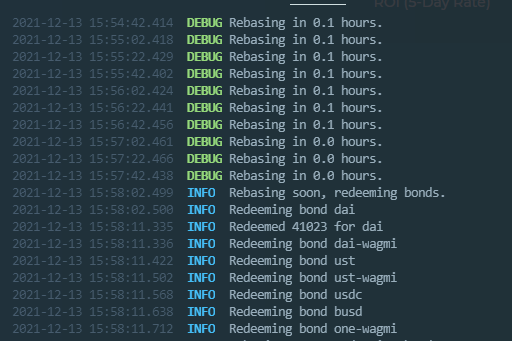
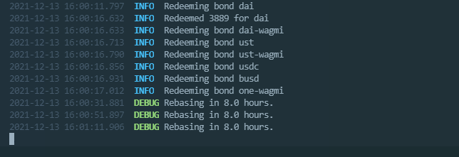

# Wagmi-autostake
This projects helps people using OHM forks like wagmi auto stake their bonds every few hours just before rebase. I decided to make one for euphoria since I'm pretty active in the harmony network.

### Instructions
1. Clone the repository
2. npm install / yarn install
3. Create an env file and add your private key with this format
```env
PRIVATE_KEY=YOUR_KEY_HERE
```
4. Run npx run scripts/autostake_wagmi.ts
5. Leave it on and enjoy

### Screenshots


