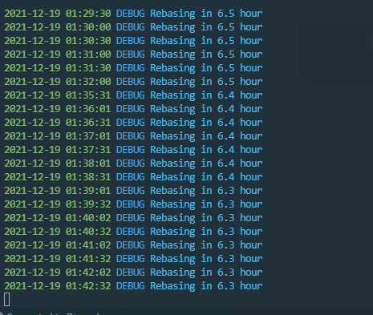
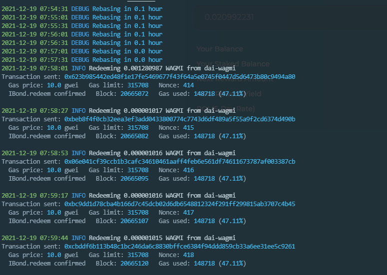

## Wagmi Autobond
Automatically stake all your wagmi bonds just before rebase

### Instructions

1. Download [brownie](https://github.com/eth-brownie/brownie)

2. Add harmony shard 0 network
```bash
brownie networks add Harmony Shard0 host=https://api.harmony.one chainid=1666600000 explorer=https://explorer.harmony.one/ 
```

OR Add Harmony POKT network

```bash
brownie networks add Harmony POKT host=https://harmony-0-rpc.gateway.pokt.network chainid=1666600000 explorer=https://explorer.harmony.one/ 
```

3. Run pip install -r requirements.txt

4. Make an .env file with your private key formatted like this
```env
PRIVATE_KEY=YOUR_PRIVATE_KEY_HERE
```
5. Run the script
```bash
brownie run scripts/auto_stake_bonds.py --network Shard0/POKT
```

### Screenshits



### Donations
Would be nice to get a little donation to my address if you enjoy my program, one10n5yjj2jjq2a2k3knwsaev0qnxcm8mscfupy2m since I don't charge a dime to use this program
